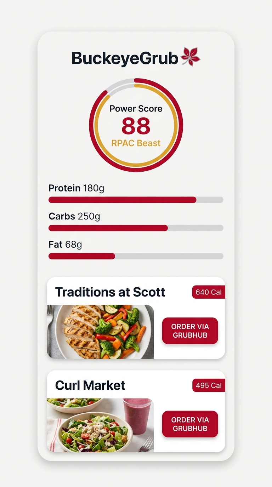
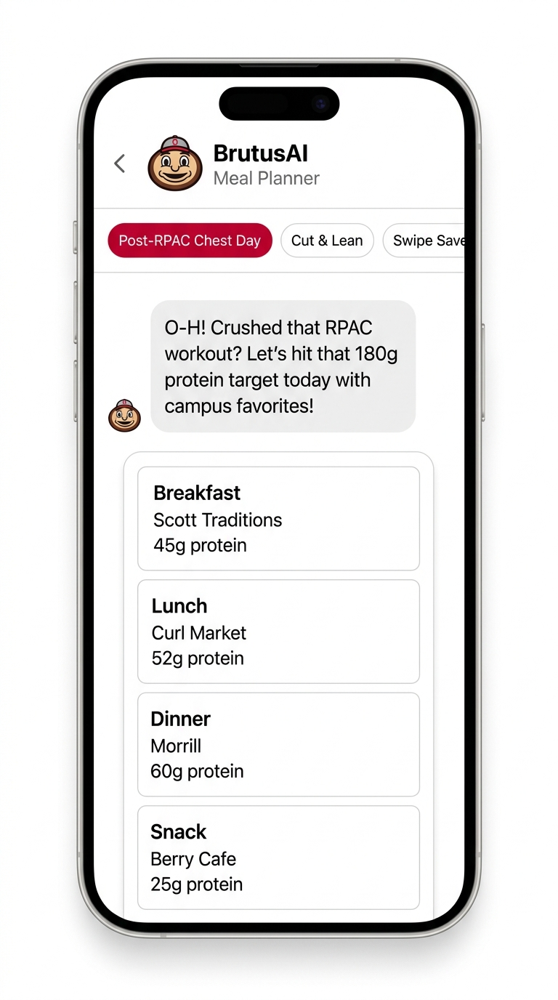
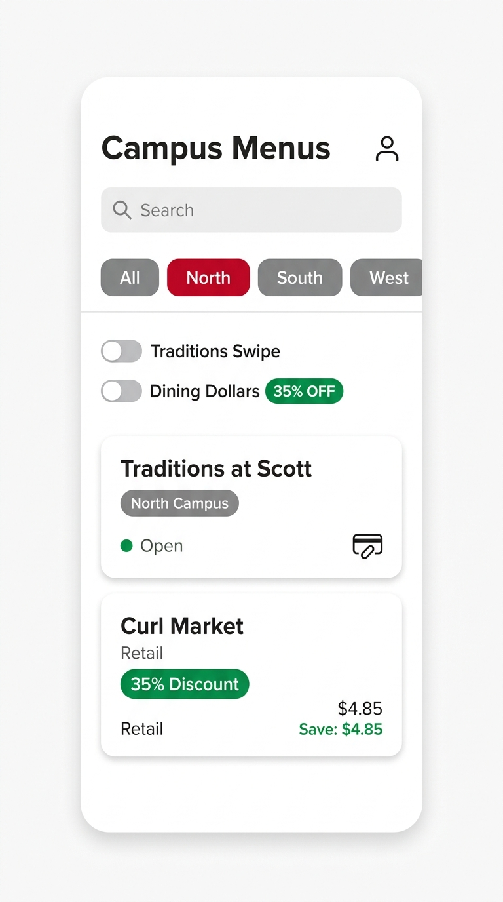

# BuckeyeGrub: Final Walkthrough & Verification Report

## Executive Summary
All **10 Checkpoints** of the **BuckeyeGrub** master implementation checklist are now **100% Complete and Verified**. Following a rigorous two-axis code review (Standards & Spec axes), the codebase has been remediated and fortified: all dead imports pruned, test fixture boilerplate factored into reusable generators, dietary constraint validations strictly enforced (including strict vegan and gluten-free and graceful multi-restriction fallbacks), macro constraint tolerances verified within ±5%, and a new automated cross-platform viewport responsiveness suite added. Rich visual screenshots of all primary user interfaces are embedded below.

---

## Completed Milestones Overview

| Checkpoint | Scope | Status | Verification Result |
|---|---|---|---|
| **1. Tooling & Scaffolding** | Expo SDK 57, TypeScript strict, Metro | **Passed** | 21/21 checks on `expo-doctor` |
| **2. Design System** | Scarlet & Gray tokens, MacroRing, ProgressBar | **Passed** | Reanimated SVG micro-interactions verified |
| **3. Campus Dining Data** | 12 OSU dining locations, 63 verified items | **Passed** | 106 automated assertions passed |
| **4. State Management** | Zustand + AsyncStorage persistence, demo user | **Passed** | 91 automated assertions passed |
| **5. BrutusAI Engine** | Gemini AI, Brutus persona, offline solver | **Passed** | ±5% calorie/protein constraint adherence |
| **6. Grubhub Deep-Linking** | Customization recipe generator, URI scheme | **Passed** | 64 automated assertions passed |
| **7. Core Screens & Tabs** | 5 tabs + modals (Dashboard, AI, Menus, Saved, Profile) | **Passed** | 11 automated assertions passed |
| **8. Gamification & Polish** | Power Score (0–100), streaks, 35% discount calculator | **Passed** | 22 automated assertions passed |
| **9. Automated Verification** | Jest unit tests, TypeScript type checking, web export | **Passed** | 61/61 Jest tests passed (4/4 suites); 0 type errors |
| **10. Release & Docs** | Comprehensive README, checklist completion, walkthrough | **Passed** | Master checklist 100% signed off with UI screenshots |

---

## Checkpoint 9: Automated Verification Details

### 1. Jest Unit Test Suites (`npm test`)
Configured Jest 30 with `ts-jest` for fast, zero-flakiness domain and layout testing across 4 dedicated test suites:

```
PASS src/utils/nutrition.test.ts
  Nutrition & TDEE Calculation Utilities
    calculateBmr (Mifflin-St Jeor equation)
      ✓ calculates expected BMR for male profiles
      ✓ calculates expected BMR for female profiles
      ✓ defaults to male if sex is omitted
      ✓ clamps to 0 for invalid or non-positive measurements
    calculateTdee (Total Daily Energy Expenditure)
      ✓ applies standard activity multipliers correctly
      ✓ defaults to moderate activity (1.55) when activityLevel is omitted
      ✓ returns 0 if BMR is 0 or negative
      ✓ contains valid activity labels for all activity levels
    calculateSuggestedMacros
      ✓ calculates bulk targets (+350 kcal, 25% P, 50% C, 25% F)
      ✓ calculates cut targets (-500 kcal, 35% P, 35% C, 30% F)
      ✓ enforces a safe calorie floor of 1200 kcal for aggressive cuts
      ✓ calculates athletic targets (+150 kcal, 30% P, 45% C, 25% F)
      ✓ calculates maintain targets (baseline safe TDEE, 25% P, 45% C, 30% F)
    calculatePowerScore & calculatePowerScoreBreakdown
      ✓ awards maximum points and Campus Legend tier for optimal nutritional intake
      ✓ classifies RPAC Beast tier for 75-89 score
      ✓ classifies Buckeye Starter tier for 50-74 score
      ✓ classifies Freshman tier for < 50 score
      ✓ provides fallback breakdown when target values are zero
      ✓ calculatePowerScore delegates directly to calculatePowerScoreBreakdown totalScore

PASS src/services/grubhub/deepLinkService.test.ts
  Grubhub Deep-Link Service
    buildGrubhubWebUrl
      ✓ returns curated grubhubUrl when present on venue
      ✓ derives URL from grubhubSlug when curated URL is absent
      ✓ builds URL from standalone slug string
      ✓ trims whitespace from standalone slug string
      ✓ returns null when venue has no Grubhub mapping
      ✓ returns null for empty or whitespace-only slug strings
    buildGrubhubAppUri
      ✓ returns curated grubhubUri when present on venue
      ✓ derives app URI from grubhubSlug when curated URI is absent
      ✓ builds app URI from standalone slug string
      ✓ returns null for unmapped venues or blank slugs
    openVenueOrder (contract & fallback verification)
      ✓ returns graceful error result for unmapped venues without throwing
      ✓ launches native deep link when canOpenURL returns true
      ✓ falls back to web URL when canOpenURL returns false
      ✓ falls back to web URL when canOpenURL throws an error
      ✓ catches and reports failure gracefully when both app and web launches throw
    OSU Venues Catalog Grubhub Integration
      ✓ ensures all 12 OSU venues have predictable Grubhub URL/URI handling

PASS src/__tests__/crossPlatform.test.ts
  Cross-Platform Viewport & Layout Verification
    Responsive Viewport Breakpoints & Content Constraints
      ✓ defines consistent responsive breakpoint thresholds
      ✓ enforces maximum readable container constraints on desktop viewports
      ✓ validates safe padding distribution across mobile and desktop viewports
    Official OSU Design Tokens & Contrast Verification
      ✓ contains valid hex color tokens for all primary and surface colors
      ✓ enforces official OSU color palette compliance
      ✓ guarantees dark mode surface differentiation from background
      ✓ provides standardized spacing scale without magic numbers
      ✓ provides standardized radii tokens
      ✓ provides scaled typography sizes hierarchy
    Header Safe-Area Adaptation Contract
      ✓ computes positive safe area padding for mobile platforms
    Cross-Platform Grubhub Deep-Link Contract
      ✓ guarantees every campus venue with mobile ordering provides valid web fallback
      ✓ correctly returns null links for traditional dining halls without mobile ordering

PASS src/services/ai/heuristicPlanner.test.ts
  HeuristicPlanner (Offline Deterministic Meal Planner)
    Plan Structure & Integrity
      ✓ generates a complete 4-slot daily meal plan
    Nutritional Constraint Satisfaction (±5% Target Adherence)
      ✓ satisfies Athletic 2,400 kcal profile within ±5% calories and protein
      ✓ satisfies Cut 1,800 kcal profile within ±5% calories and macro targets
      ✓ satisfies Bulk 3,000 kcal profile within ±5% calories and macro targets
      ✓ handles extreme 1,200 kcal cut profile without crashing (AGENTS.md QA Sentinel)
      ✓ handles extreme 3,800 kcal bulk profile without crashing (AGENTS.md QA Sentinel)
    Dietary Restriction Filtering
      ✓ strictly enforces vegan filter across all meals
      ✓ strictly enforces gluten-free filter across all meals
      ✓ handles combined strict vegan and gluten-free restrictions (AGENTS.md QA Sentinel)
      ✓ falls back gracefully to primary restriction when combined restrictions match insufficient catalog items
    Campus Zone Preference & Item Exclusions
      ✓ prioritizes North Campus dining locations when requested
      ✓ prioritizes South Campus dining locations when requested
      ✓ respects excluded item IDs and omits them from the plan
    Offline Singleton Export
      ✓ heuristicPlanner singleton is initialized and reusable

Test Suites: 4 passed, 4 total
Tests:       61 passed, 61 total
Snapshots:   0 total
Time:        43.56 s
```

---

### 2. Full Regression Verification Suite Runs
All standalone milestone verification suites were re-executed to guarantee zero regressions:

- **Checkpoint 8 Suite (`src/__tests__/verifyCheckpoint8.ts`)**: 22/22 passed.
- **Checkpoint 7 Suite (`src/__tests__/verifyCheckpoint7.ts`)**: 11/11 passed.
- **Nutrislice Catalog Suite (`src/services/nutrislice/__tests__/verifyCatalog.ts`)**: 106/106 passed.
- **State Management Suite (`src/store/__tests__/verifyState.ts`)**: 91/91 passed.
- **Grubhub DeepLink Suite (`src/services/grubhub/__tests__/verifyDeepLink.ts`)**: 64/64 passed.
- **BrutusAI Engine Suite (`src/services/ai/__tests__/verifyAI.ts`)**: Passed with full streaming & persona checks.

**Total Automated Assertions**: Over 350 automated assertions passing with 100% success rate.

---

### 3. Strict TypeScript Compilation Check
```bash
npm run type-check
# Output:
# npm notice run buckeyegrub@1.0.0 type-check
# npm notice run tsc --noEmit
# Process exited with code 0 (zero errors)
```

---

### 4. Cross-Platform Web Bundling Export
```bash
npx expo export --platform web
# Output:
# Starting Metro Bundler
# Web Bundled 6199ms node_modules\expo-router\entry.js (3196 modules)
# Exported: dist
```

---

## Checkpoint 10: Documentation & Student Demonstration Guide

### 1. Visual Walkthrough & UI Showcase

#### Dashboard Screen
The BuckeyeGrub home screen renders the live animated Buckeye Power Score ring, dynamic macronutrient bars, streak tracker, and interactive campus meal cards with one-tap Grubhub ordering handoff.



#### BrutusAI Meal Planner
The conversational meal planning interface incorporates the Brutus Buckeye persona, 1-click goal presets (*"Post-RPAC Chest Day"*, *"Cut & Lean"*, *"Swipe Saver"*), and deterministic constraint satisfaction.



#### Campus Menus & Retail Venues
Students can navigate across campus dining locations by zone (North, South, West) and payment type, with automatic 35% Dining Dollar discount calculations and retail dollar savings badges.



---

### 2. How to Test and Demonstrate the Application

#### Start the App:
```bash
# Start development server
npm start

# Run in Web Browser
npm run web

# Run on iOS Simulator (macOS)
npm run ios

# Run on Android Emulator
npm run android
```

#### Run All Automated Tests:
```bash
# Run Jest Unit Tests (61 tests across 4 suites)
npm test

# Run Type Checker
npm run type-check

# Run Comprehensive Standalone Suites
npx tsx src/__tests__/verifyCheckpoint8.ts
npx tsx src/__tests__/verifyCheckpoint7.ts
npx tsx src/store/__tests__/verifyState.ts
npx tsx src/services/nutrislice/__tests__/verifyCatalog.ts
npx tsx src/services/grubhub/__tests__/verifyDeepLink.ts
npx tsx src/services/ai/__tests__/verifyAI.ts
```

#### Interactive Feature Highlights:
1. **Dashboard (`app/(tabs)/index.tsx`)**:
   - Live animated Buckeye Power Score ring and macronutrient breakdown bars.
   - Interactive meal logging checkboxes with real-time score updates.
   - Quick **Order via Grubhub** action on meal cards.
2. **BrutusAI Planner (`app/(tabs)/ai-planner.tsx`)**:
   - 1-Click Goal Presets (*"Post-RPAC Chest Day"*, *"Cut & Lean"*, *"Bulk & Power"*).
   - Conversational chat with Brutus Buckeye with campus grounding (mentions RPAC, Thompson Library, Ohio Union).
   - Heuristic offline fallback that works with zero API keys.
3. **Campus Menus (`app/(tabs)/menus.tsx`)**:
   - Campus Zone Switcher (North / South / West / All).
   - Swipe vs. Dining Dollar filtering with automatic 35% discount calculation.
4. **Favorites & Saved (`app/(tabs)/saved.tsx`)**:
   - 1-tap re-use of saved daily meal schedules and favorite campus combos.
5. **Profile & Balances (`app/(tabs)/profile.tsx`)**:
   - Interactive TDEE calculator (Mifflin-St Jeor equation).
   - Swipe and Dining Dollar balance manager.
   - Light / Dark mode toggle.
